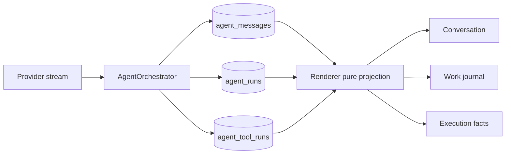

# 内置 Agent 工作过程可观察性目标设计

更新时间：2026-09-03

状态：分阶段实施中。结构化 assistant item、Provider turn 内存 writer、终态事务、上下文过滤、专用 item IPC、renderer 流式对账、工作过程 UI、状态选择器与 Tool 分组已经落地；独立 Workflow / Active Run Dock 已从当前界面撤下，Phase 1C 仍待手工视觉验收，reasoning summary 尚未落地。

适用范围：

- `src/shared/agent/`
- `src/features/agent/`
- `electron/ipc/agent.ts`
- `electron/service/agent/`
- OpenAI-compatible、Claude 和后续 Provider 适配层

本文定义 OmniFlow Agent 如何让用户看见“正在做什么、接下来准备做什么、实际执行了什么”，同时不伪造或暴露模型隐藏思维链。当前已经落地的能力仍以 `docs/built-in-agent-architecture.md` 为准，当前页面职责仍以 `docs/built-in-agent-ui-contract.md` 为准。本文中明确标记尚未落地的事件和界面不能被描述为现有能力。

## 1. 问题与目标

改造前 Agent 已经具有 Run、ToolRun、计划、审批、交互、进度、恢复和终态对账，但用户在模型请求与 Tool 之间只能看到较笼统的 `currentStep`。这产生了三个问题：

- 长时间等待时，不知道 Agent 是在读取上下文、执行 Tool，还是已经偏离任务。
- 多轮 Tool loop 的 assistant 文本曾被累计成一个回答，无法区分过程说明和最终答复；协议层与展示层现已拆分，仍需完成手工视觉验收。
- UI 有工具事实，却缺少稳定的模型工作项，流式文本、Tool 和最终答复之间的顺序不够明确。

目标：

- 默认展示简短、可理解的工作过程，而不是只显示“正在思考”。
- 把模型过程说明、最终回答、计划和 Tool 事实分开建模。
- 每个流式工作项具有稳定 ID，并按 `started -> delta -> finished` 原地更新。
- 让“当前状态”和“下一步”来自规范事实，不让 renderer 猜测。
- 应用重启、页面卸载、迟到事件和流式中断后仍能恢复一致时间线。
- 保持 SQLite 为唯一持久化事实源，不复制第二份 assistant 内容。

非目标：

- 不展示原始 chain-of-thought、隐藏推理 token 或未经 Provider 明确声明的 reasoning 内容。
- 不让模型过程说明改变 Run、计划、ToolRun、审批或交互事实。
- V1 不增加自由文本 `agent.status.update` Tool，不为每次普通读取强制增加模型输出。
- V1 不同时重做计划协议、并行 Tool、子 Agent 或后台 Job。

面向用户统一使用“工作过程”或“思路摘要”，不使用“思维链”描述这项能力。

## 2. 参考实现结论

### 2.1 Codex

Codex 将 assistant 内容区分为 `commentary` 和 `final_answer`，并把 reasoning summary、计划和 Tool 作为独立稳定 item。每个 item 都有明确生命周期，而不是把所有流式文本追加到一个 Run 级字符串。

值得采用：

- commentary 与 final 分离。
- item 具有稳定身份，增量只更新同一 item。
- reasoning summary 只有 Provider 明确支持时才展示。
- 计划与 Tool 执行事实分开。
- 连续读取和搜索可以在展示层语义分组。

### 2.2 OpenCode

OpenCode 将消息拆成 text、reasoning、tool、retry、step 等稳定 part；Tool 独立经历 pending、running、completed 或 error。Todo 作为单独投影，不混入对话正文，权限、问题和重试也使用结构化状态。

值得采用：

- 顶部当前状态与完整历史分离。
- Tool 状态原地更新，默认收起重内容。
- 连续 read、list、search 可以压缩成上下文收集组。
- 等待用户、重试、Tool 和计划有明确的状态优先级。

不照搬：

- 不把供应商的任意 `thinking_delta` 或兼容端点的 `reasoning_content` 自动当成安全摘要。
- 不只使用 `idle / busy / retry` 三种粗状态；OmniFlow 继续保留审批、交互、取消和中断语义。
- 不让任意字符串充当计划状态或优先级。

## 3. 总体模型

页面仍然是一条统一时间线，但由三种规范投影组成：

```text
Conversation
  user message
  completed final assistant message

Work journal
  commentary assistant item
  streaming / incomplete assistant item
  provider-supported reasoning summary（Phase 2）

Execution facts
  Run
  Plan
  ToolRun / approval / interaction / progress / result
```

三种投影不是三份状态。它们共享 main + SQLite 中的规范事实：



事实优先级：

```text
Run / ToolRun / approval / interaction
> 结构化计划
> Provider commentary / reasoning summary
> renderer 动画和临时文案
```

commentary 可以解释方向，但不能证明 Tool 成功、文件已经写入、审批已经通过或计划已经完成。

### 3.1 目标体验

一次多步骤任务在界面中的逻辑顺序应接近：

```text
用户：检查视频并提取音频

任务进度  1/3
当前：正在检查视频信息
下一步：提取第一条音轨

正在确认视频格式和音轨信息。            <- commentary
收集了 3 项上下文                         <- 可展开的只读 Tool 组
检查媒体  已完成                          <- Tool 事实
提取音频  等待确认                        <- 审批事实

已提取音频并保存到指定位置。              <- final
```

如果模型没有输出 commentary，上述过程仍由任务进度和 Tool 事实成立；页面只能显示“正在思考”，不能自行补写模型正在考虑的内容。

## 4. 核心决策：扩展 agent_messages

V1 扩展现有 `agent_messages`，不新增 `agent_assistant_items`。

原因：

- `agent_messages` 已经保存 user、assistant 和 tool 文本，并由 Session 内单调递增的 `sequence` 排序。
- 每个 Provider turn 可以在同一行从 streaming 更新到 terminal，最终回答不需要双写。
- commentary 行先获得 `sequence`，其后的 Tool message 自然获得更大的 `sequence`，无需再用时间戳猜顺序。
- UI key 继续使用 `message:${id}`，流式、定类和终态不会重挂载组件。

独立 assistant 表会同时引入“final 内容双份事实”和“跨表排序”两个问题，V1 没有足够收益。未来 reasoning summary 如果需要独立保留和权限策略，应作为非对话工作项另行设计，不能借机复制 final 内容。

## 5. 领域类型

目标共享类型：

```ts
export type AgentAssistantPhase =
  | 'unknown'
  | 'commentary'
  | 'final';

export type AgentAssistantStatus =
  | 'streaming'
  | 'completed'
  | 'failed'
  | 'cancelled'
  | 'interrupted';

export interface AgentAssistantItemState {
  finishedAt?: string;
  phase: AgentAssistantPhase;
  revision: number;
  status: AgentAssistantStatus;
  turnOrdinal: number;
  updatedAt: string;
}

interface AgentMessageBase {
  content: string;
  createdAt: string;
  id: string;
  runId?: string;
  sessionId: string;
  toolCallId?: string;
  toolName?: string;
}

export type AgentNonAssistantMessage = AgentMessageBase & {
  assistantItem?: never;
  role: Exclude<AgentMessageRole, 'assistant'>;
};

export type AgentAssistantItemSnapshot = AgentMessageBase & {
  assistantItem: AgentAssistantItemState;
  role: 'assistant';
  runId: string;
};

export type AgentMessage =
  | AgentNonAssistantMessage
  | AgentAssistantItemSnapshot;
```

`AgentMessage.id` 同时就是 assistant item ID，不再增加另一套 identity。判别联合还应在共享类型层拒绝“user 或 tool 消息携带 assistantItem”等非法组合，不能只依赖 SQLite 约束。

## 6. SQLite 目标结构

`agent_messages` 增加：

```sql
assistant_phase         TEXT
assistant_status        TEXT
assistant_turn_ordinal  INTEGER
revision                INTEGER NOT NULL DEFAULT 1
updated_at              TEXT NOT NULL
finished_at             TEXT
```

索引：

```sql
CREATE UNIQUE INDEX agent_messages_run_assistant_turn_idx
ON agent_messages(run_id, assistant_turn_ordinal)
WHERE role = 'assistant'
  AND assistant_turn_ordinal IS NOT NULL;

CREATE UNIQUE INDEX agent_messages_run_assistant_final_idx
ON agent_messages(run_id)
WHERE role = 'assistant'
  AND assistant_phase = 'final'
  AND assistant_status = 'completed';

CREATE UNIQUE INDEX agent_messages_run_assistant_streaming_idx
ON agent_messages(run_id)
WHERE role = 'assistant'
  AND assistant_status = 'streaming';
```

结构不变量：

- 非 assistant 行的三个 `assistant_*` 字段和 `finished_at` 必须为 `NULL`；其 revision 固定为 1，`updated_at = created_at`。
- 新 assistant item 必须同时具有 phase、status、turn ordinal、revision 和 updated time。
- `turnOrdinal` 从 1 开始，在 Run 内严格递增；它表示 Provider turn，不代替 Session `sequence`。
- 同一 Run 最多只能有一个 streaming assistant item。
- `streaming` 只能与 `unknown` 组合，且没有 `finished_at`。
- `completed` 只能与 `commentary` 或 `final` 组合，且必须有 `finished_at`。
- `failed / cancelled / interrupted` 只能与 `unknown` 组合。
- ID、Session、Run、sequence、role、turn ordinal 和 created time 创建后不可修改。
- streaming 行只提供稳定 item 身份，content 在 SQLite 中保持为空；实时内容由 main 内存 writer 和事件流持有。
- revision 在 terminal 提交时严格加一，terminal item 不得再次更新。
- 采用结构化 assistant item 的新 Run 成功时必须且只能有一个 `completed / final`。
- `completed / final` 的 content 清洗后不能为空；空 commentary 可以保留为隐藏轮次锚点。
- 采用结构化 assistant item 的 failed、cancelled 或 interrupted Run 不得拥有 `completed / final`。
- Run 进入终态前不得遗留 streaming assistant item。

### 6.1 本地数据切换策略

当前 Agent 尚未正式发布，不承担旧会话兼容：

- 不识别、不迁移、不启发式回填旧 assistant 行。
- 首次发现 assistant item 基线字段缺失时，按依赖顺序清空本地 Agent Session、Run、Message、ToolRun 和 checkpoint，再使用当前基线建表。
- 本功能不单独增加 `user_version = 3`；`agent-persistence-runtime.ts` 的 schema manifest 必须与当前基线同步。
- 正式发布后若再次修改表结构，必须重新制定真实迁移策略，不能继续依赖预发布清空规则。

### 6.2 Session 列表语义

- `last_message_preview` 只由 user 或 completed final 更新。
- commentary、空 assistant turn 和失败的部分输出不得覆盖会话预览。
- 会话列表的 `messageCount` 统计对话消息，不把 commentary 和 Tool 审计项当成对话轮数。
- Session `updated_at` 只在用户提交、Run 终态等有意义边界更新，不随 delta 改写，避免会话列表持续重排；失败或取消可以更新 recency，但必须保留原 preview。

## 7. Provider turn 生命周期

每个 Provider turn 对应一个稳定 assistant item：

```text
unknown / streaming
       |
       +-- 有 Tool call ----------> commentary / completed
       |
       +-- 无 Tool call且 Run 成功 -> final / completed
       |
       +-- Provider 失败 ----------> unknown / failed
       +-- 用户取消 --------------> unknown / cancelled
       `-- 崩溃恢复 --------------> unknown / interrupted
```

规则：

- V1 延续同一 Session 最多一个 active Run、同一 Run 最多一个 active Provider turn；并行 turn 需要新的顺序与归属协议。
- Provider 请求开始前创建空 item 并获得稳定 ID、turn ordinal 和 Session sequence。
- 当前 Chat Completions 与 Claude Messages 没有可信 phase；必须在本轮返回完整 `toolCalls` 后定类，禁止分析文字内容猜测。
- 有 Tool call 的 turn 定类为 commentary；即使内容为空，也保留为隐藏的结构化轮次锚点，不渲染空白行。
- 无 Tool call 且 Run 正常完成的 turn 定类为 final。
- Provider 明确提供受信任 channel 时可以提供 phase hint，让 UI 更早选择样式，但 V1 终态仍按 Tool call 与 Run 结果分类。一个 Provider response 内出现多个语义 item 时，必须先升级 adapter 和事件协议，不能强行塞进同一行。
- 异常、取消或崩溃时丢弃当前尚未完成的内存文本，只保留空的 unknown 终态锚点；此前完成的 commentary、Tool 和 final 不受影响。
- commentary 在当前活跃 Run 内仍作为原始 assistant Tool-call message 参与后续 Provider turn，这是 Tool 协议需要；它不能进入未来 Run 的会话历史。

Run 级 `content` 累加方式已经移除。每轮 writer 只拥有本轮内容，Run 终态事件不再依赖一个混合了 commentary 与 final 的总字符串。

## 8. 流式事件与边界持久化

采用与 Codex 相同的分层：delta 高频发送给 renderer，但不逐 delta 写 SQLite。每个活跃 turn 由 Orchestrator 持有单一内存 writer：

```text
liveContent
itemId
initialRevision
closed
```

约束：

- Provider delta 只追加到有界 `liveContent` 并发送实时事件，不产生 SQLite UPDATE。
- 有 Tool call 时，在 Tool prepare 或执行前一次性把完整 `liveContent` 提交为 `commentary / completed`。
- 无 Tool call且 Run 成功时，在同一终态事务中一次性把完整 `liveContent` 提交为 `final / completed`。
- SQL terminal transition 使用 `expectedRevision` CAS；一个 item 从空 streaming 行直接进入终态。
- Provider 失败、用户取消或进程崩溃时不提交当前半成品；空 item 只转换为对应 unknown 终态，并由 UI 隐藏空行。
- 应用运行期间的 renderer 重载恢复应读取 main 活跃 writer 的规范内存快照；应用进程崩溃后允许丢失当前未完成 item。
- 已经完成的 commentary、ToolRun 和 final 都是独立持久化事实，不会因后续 turn 中断而丢失。

## 9. 终态事务与恢复

### 9.1 正常完成

final item 与 Run completed 必须在同一事务内：

```text
BEGIN IMMEDIATE
  CAS finish assistant item:
    unknown / streaming -> final / completed
  CAS finish Run:
    active -> completed
  UPDATE agent_sessions:
    last_message_preview = final content preview
    updated_at = finished time
COMMIT
```

这条 assistant row 本身就是最终回答，不再插入第二条 final message。

现有 `agent_messages_update_session` 只监听 INSERT，而新 assistant item 会先以空内容插入。实现时必须替换或收窄该触发器：streaming INSERT 和 commentary finished 不得清空预览或让 Session 列表持续跳动；final preview 与 Run completed 必须在上述同一事务内发布。

### 9.2 Tool 转场

在开始任何 Tool prepare、审批或执行前：

1. 关闭当前内存 writer，并一次性提交完整 assistant item。
2. 将它定类为 `commentary / completed`。
3. 提交后发送 item finished 事件。
4. 才允许创建或执行 ToolRun。

这样 commentary 一定排在它所说明的 Tool 之前，且模型文字不能晚于真实副作用落盘。

### 9.3 失败与取消

失败或取消也使用单一事务：

```text
BEGIN IMMEDIATE
  若存在 streaming assistant item：
    丢弃内存半成品，空行 -> unknown / failed | cancelled
  Run -> failed | cancelled
  由既有 Run 收口规则处理未完成 Tool、审批和交互
COMMIT
```

### 9.4 崩溃恢复

`recoverInterruptedState()` 在一个事务内按顺序处理：

1. 将空的 streaming assistant 行改为 `unknown / interrupted`。
2. active Run 改为 interrupted。
3. 收口未完成 Tool、审批和交互。
4. started context checkpoint 改为 interrupted。
5. 一次提交。

恢复后不自动续跑。UI 通过 Run 终态展示“输出已中断”，不渲染空 assistant 行，也不把它放入最终答复或未来上下文。

## 10. IPC 事件协议

目标事件：

```ts
type AgentAssistantStreamEvent =
  | {
      item: AgentAssistantItemSnapshot;
      runId: string;
      sessionId: string;
      type: 'assistant-item-started';
    }
  | {
      delta: string;
      itemId: string;
      offset: number;
      runId: string;
      sessionId: string;
      type: 'assistant-item-delta';
    }
  | {
      item: AgentAssistantItemSnapshot;
      runId: string;
      sessionId: string;
      type: 'assistant-item-finished';
    };
```

典型顺序：

```text
started(run)
assistant-item-started(turn 1)
assistant-item-delta*
assistant-item-finished(commentary)
tool-started / progress / completed
assistant-item-started(turn 2)
assistant-item-delta*
assistant-item-finished(final)
run-updated(completed)
completed(canonical snapshot)
```

`offset` 使用 JavaScript UTF-16 code unit，与 `string.length` 一致。Renderer 合并规则：

- `offset === current.length`：追加。
- `offset < current.length`：验证重叠内容，只追加尚未出现的后缀。
- `offset > current.length`：出现缺口，暂停该 item 本地拼接并请求规范快照。
- 重叠内容不一致：停止拼接，等待规范快照，不能猜测修复。
- 完整 snapshot 按 `assistantItem.revision` 合并：更低 revision 忽略，相同 revision 必须内容与状态一致。更高 revision 的 streaming snapshot 若只是当前 live content 的前缀，则更新持久化 revision 并保留已收到的 live 后缀；若它包含更多规范内容则前向补齐；内容分叉时进入 desynced，不能直接截断或拼接。
- completed terminal snapshot 应包含该 item 的全部已发 delta；failed、cancelled 或 interrupted snapshot 可以为空。若与 renderer live content 分叉，始终使用 terminal snapshot，不能让临时文本继续污染终态。
- item 一旦进入 terminal，拒绝其后所有 started 和 delta；只接受内容与状态完全相同的同 revision snapshot 作为幂等重放。任何不同或更高 revision snapshot 都视为协议冲突并触发 Session 规范重读，terminal 状态绝不能回退。
- item 进入 gap / desynced 状态后，在取得更新的完整规范 snapshot 前不再拼接后续 delta。
- `assistant-item-finished` 和 Run terminal 事件携带的完整 item 是规范对账入口，但仍必须遵守 revision 单调性和 terminal sticky 规则。

事件缓冲只能合并相同 `sessionId + runId + itemId` 的连续 delta，不能只按 Run 合并。当前协议不保留无 item ID 的裸 `delta`，main 与 renderer 也没有 legacy 兼容分支。

恢复时必须先订阅事件再读取快照，并缓冲读取期间收到的事件。应用进程仍存活时，活跃 writer 必须返回能填补绝对 offset 的完整内存 item；不能为了 renderer 恢复把 delta 写进 SQLite，也不能静默接受流式缺口。

## 11. 上下文与摘要边界

未来 Run 的 Provider history 和会话摘要使用同一过滤规则：

- user：保留。
- `completed / final`：保留。
- commentary：排除。
- streaming、failed、cancelled、interrupted assistant：排除。
- Tool 执行事实继续通过现有结构化 Run + ToolRun 投影，不从 commentary 恢复。

摘要的语义输入和 checkpoint 的物理覆盖边界必须分开：

- 摘要输入只包含上述符合条件的 user 和 completed final。
- `throughMessageId / throughSequence` 必须指向“最后一个被完整覆盖的 terminal Run”的最后一条物理 message；该行即使是 commentary、unknown 或 tool，也可以只作为覆盖边界而不进入摘要正文。
- active Run 不能成为 checkpoint 边界，checkpoint 不能切开同一个 Run。
- 失败或取消 Run 即使只有 user 可进入摘要，仍可以用该 terminal Run 的最后一条物理 message 作为 boundary，避免后续反复处理同一 Run。

commentary 不进入摘要，也不更新用户长期记忆。它只是本 Run 的低权限工作日志，不能因为措辞像用户决定就升级成授权或历史事实。

## 12. 状态、下一步与偏离

页面当前状态按以下优先级选择：

```text
等待用户交互或审批
> 自动重试与倒计时（未来）
> 当前 Tool 及其 progress
> 当前计划项
> 最新 commentary / reasoning summary（支持时）
> legacy currentStep fallback
> 正在思考
```

状态选择器必须是纯函数，并只消费规范 snapshot。多个来源同时存在时只显示最高优先级的一个主状态，其他事实仍保留在时间线。

`currentStep` 只允许作为 main 生成的兼容运行状态，不能来自模型自由文本。Phase 1 应逐步用结构化状态替代“根据工具结果继续思考”等泛化文案；在完全移除前，它仍排在无信息的“正在思考”之前。

“正在思考”只在 Run active 且正在等待或接收 Provider turn 时出现；idle 或 terminal Session 不显示虚假的活动状态。

候选状态还必须先排除已经被后续事实取代的旧内容。例如 commentary 之后已经开始 Tool 时由 Tool 覆盖；Tool 完成并开始下一轮 assistant item 后显示“正在思考”，不能重新拿上一轮 commentary 充当当前状态。

“当前”和“下一步”只能来自结构化计划：

- “当前计划项”只指绑定到 active ToolRun 的计划步骤，不能把尚未执行的计划写成“正在执行”。
- 存在 active 计划步骤时，“下一步”取其后第一个尚未开始的步骤；没有 active 步骤时，取第一个尚未开始的步骤。
- 没有计划时不显示“下一步”，不得从普通文本推断。
- commentary 可以写“接下来检查文件”，但 UI 只能把它作为模型说明，不能升级成结构化下一步。
- 有 plan 但业务 ToolRun 没有 `planStepId` 时，标记为“计划外步骤”；`agent.plan.set`、Skill 激活等控制 Tool 不参与偏离判断。
- 当前没有 retry identity；重复 Tool 不得自动标成“重试”。未来只有增加 `retryOfToolRunId` 等明确元数据后才能使用该标签。

V1 继续保留一次性 `agent.plan.set`。可修订计划需要独立 plan revision、历史审计和 Tool 重新绑定规则，不与可观察性首期混做。

## 13. Renderer 时间线投影

统一时间线至少支持：

```text
user-message
assistant-work-item
tool-activity / tool-group
assistant-final
reasoning-summary（Phase 2）
```

排序规则：

- Message 使用不可变 `sequence`。
- assistant item 与最终回答始终使用 `message:${id}`。
- 已有 tool message 时，继续用 `runId + toolCallId` 替换为 ToolActivity 卡。
- 活跃 Tool 尚无 tool message 时，锚在同 Run 最新结构化 assistant item 之后。
- 多 Tool 仍按持久化 `ordinal` 排序。
- 时间戳只用于损坏或 legacy 数据的降级排序。

视觉层级：

- user 与 final 保持正常对话内容。
- commentary 使用轻量、无外层卡片的工作过程行。
- unknown streaming item 使用同一个稳定 DOM；完成后只改变语义样式，不移动或重挂载。
- 空 commentary 不渲染空白行。
- 空的 failed、cancelled 或 interrupted item 也不渲染空白行，Run 终态仍由执行事实展示。
- 未完成 item 明确显示失败、取消或中断，不与 final 共用成功样式。
- 每轮 user 消息后与 Composer 上方均不展示独立 Workflow / Run 摘要条。
- Tool 卡是执行详情、审批和交互的唯一入口，不重复参数、日志和结果正文。

### 13.1 Tool 语义分组

分组只发生在 renderer 投影，不改变 ToolRun：

- 仅分组同一 Run、连续、由 Tool Registry 元数据确认只读且属于同一工作阶段的 list、stat、read、search 语义 Tool，不能只匹配显示名称。
- write、destructive、external、审批、交互、失败、取消、中断、Shell active 和 commentary 都立即断组。
- 分组摘要可以显示读取、搜索和目录数量；展开后必须保留每个 ToolRun 的状态与详情。
- 未知 Tool 默认不分组。
- 分组 key 从首个 ToolRun ID 派生；同一连续分组追加成员时不能重挂载整组。

如果现有 Tool Registry 还没有稳定的 `groupKind / operationKind` 展示元数据，实现时应先增加受控枚举；禁止在 React 组件里维护一份按 Tool 名称猜测的分组名单。

### 13.2 稳定性与可访问性

- delta、progress、revision 和 phase 更新不得更换 React key。
- 用户向上阅读时，新状态不得强制滚动到底部。
- 动态状态使用克制的 live region，不能逐 token 重复朗读。
- 工作中动效遵守 `prefers-reduced-motion`。
- 待确认、待输入、失败和中断默认可见，不能被上下文分组折叠掉。

### 13.3 不重复展示 Run 摘要

当前界面不挂载 Active Run Dock 或历史 Workflow 卡：

- 活跃与终态 Run 都不在 user 消息后生成“任务进度”摘要，也不在 Composer 上方复制当前状态。
- Run、Plan 和状态 selector 继续作为规范事实与内部纯投影保留，不建立第二份 renderer 状态。
- 等待审批或交互时，只允许时间线对应 ToolActivity 存在一个可编辑实例，不能复制表单草稿或提交入口。
- 删除汇总卡不隐藏 ToolActivity、审批、交互、失败、中断或最终回答。

## 14. 模型过程说明 Prompt

System prompt 增加简短工作过程约束：

- 非平凡 Tool 工作开始前，用一句短说明告诉用户将做什么。
- 发现会改变执行方向的重要事实时，简短说明变化。
- Tool 失败且准备改换路径或重试前，简短说明原因和方向。
- 不重复用户原话，不逐个播报普通读取，不写详细内部推理，不预测未发生的成功。
- commentary 与 Tool call 应尽量在同一个 Provider turn 返回，不能为了状态文字额外制造空转轮次。

V1 先测量不同模型的遵循率。只有模型经常连续调用 Tool 而完全没有过程说明，才评估受控 `agent.status.update`；该 Tool 也只能写工作日志，不能修改执行事实或授权。

没有 commentary 时，页面继续诚实展示已经存在的 ToolRun；Provider 尚未产生可展示内容时不额外生成“正在思考”或计划摘要卡，绝不伪造模型说明。

## 15. Reasoning summary 策略

Reasoning summary 属于 Phase 2：

- OpenAI 只有切换到支持该能力的 Responses API 适配器，并显式请求 summary 后才可展示。
- Provider 必须明确声明内容是可展示摘要；普通 `thinking_delta`、`reasoning_content` 或隐藏 token 不满足条件。
- 不支持时只显示 factual status、commentary 和“正在思考”。
- UI 标题使用“思路摘要”，默认折叠，内容有长度上限并按纯文本安全展示。
- reasoning summary 不能进入未来 Provider history、会话摘要、计划匹配、审批或 Tool 状态。
- reasoning summary 不是 assistant final，不能复用 final 内容字段形成第二份回答事实。

持久化 reasoning summary 前必须单独确认来源标识、保留策略、跨 item 排序和隐私边界；V1 不预留一个含义模糊的文本字段。

## 16. 安全与资源限制

- commentary、final 和 reasoning summary 都是不可信模型文本，只按现有纯文本策略渲染。
- 不渲染模型提供的 HTML、JSX、CSS、事件、任意 URL、本地路径或可执行动作。
- Tool 成败、文件存在、写入提交和审批结果只来自 main 的规范 snapshot。
- 所有 assistant item 继续使用单 turn 和单 Run 字符上限。
- delta、持久化快照、IPC 事件和错误文案必须经过现有敏感信息清洗边界。
- 工作日志不得保存 API Key、Cookie、签名 URL、物理 workspace 路径或原始 Shell 环境。
- Renderer 不能直接写 assistant phase、status、revision 或 content。

## 17. 分阶段实施

主要改动落点：

| 边界 | 主要文件 | 目标 |
| --- | --- | --- |
| 共享协议 | `src/shared/agent/agent.types.ts` | 判别联合、assistant item snapshot、显式流事件 |
| 持久化 | `agent-session-store.ts`、`agent-persistence-runtime.ts` | schema、不变量、终态 CAS、终态事务、恢复 |
| Provider loop | `agent-orchestrator.ts`、`agent-provider-client.ts` | 每 turn 内存 writer、分类、Tool 前提交、Prompt 约束 |
| 上下文 | `agent-context-projection.ts`、`agent-context-manager.ts` | commentary 过滤、摘要输入与物理 boundary 分离 |
| Renderer 状态 | `useAgentSession.ts`、`agent-stream-messages.ts` | itemId + offset 合并、terminal sticky、规范对账 |
| Renderer 投影 | `agent-timeline.ts`、`agent-workflow-projection.ts` | 三类投影、状态 selector、下一步、只读 Tool 分组 |
| UI | `AgentTimeline.tsx`、Tool / Composer 周边组件 | 工作过程行、ToolActivity，以及时间线中的单一审批/交互实例 |

### Phase 1A：持久化与状态机

- 扩展 `AgentMessage`、SQLite baseline、runtime schema manifest 和 Store API。
- 增加 assistant turn writer、terminal CAS transaction 和 interrupted recovery。
- 过滤未来上下文、摘要、会话预览和会话计数。

完成标准：Store 可以独立证明单一 final、terminal 原子性、commentary 隔离和崩溃收口。

### Phase 1B：Provider 与 IPC（已完成）

- 将 Orchestrator 从 Run 级 content 改成每 turn item。
- 增加 started、delta、finished 事件和绝对 offset。
- 在 Tool 副作用前完成 commentary item。
- 更新 Prompt，并保留无 commentary 的 factual fallback。

完成标准：多轮 `commentary -> Tool -> final` 可流式运行并从规范快照恢复。

### Phase 1C：Renderer 投影（实现完成，待手工视觉验收）

- `useAgentSession` 已实现事件缓冲、terminal 对账和 gap / conflict 主动快照修复。
- 时间线已拆分 conversation、work journal 和 execution facts；commentary 使用稳定 `message:${id}` 的轻量工作过程行，空 item 不产生空白 UI。
- 状态 selector 保留结构化优先级、当前/下一步和计划外标记，但当前界面不挂载历史 Workflow 或 Composer 上方 Active Run Dock。
- Tool Registry 已提供 renderer-safe `kind / risk / groupKind / operationKind`；只有连续、成功、无需审批或交互的同阶段只读 Tool 才分组，未知 Tool fail-closed。
- pending approval / interaction 的可编辑实例只存在于时间线对应 ToolActivity，避免两份草稿和提交入口。

完成标准：刷新、卸载返回、重复事件和迟到事件都不产生重复卡片、空白气泡或内容跳位。

### Phase 2：Provider reasoning summary

- 增加支持 Responses API 的 Provider adapter。
- 显式请求并规范化 reasoning summary 生命周期。
- 单独评审持久化、隐私和 UI 折叠策略。

### Phase 3：计划修订与重试事实

- 只有真实需求出现后，再设计 plan revision、retry identity 和自动重试倒计时。
- 不从 commentary、相同 Tool 名或相似参数反推这些事实。

## 18. 测试矩阵

Store：

- assistant turn ordinal 单调且唯一。
- 成功 Run 只能有一个 completed final。
- CAS 拒绝旧 revision、身份修改和 terminal 二次更新。
- commentary 不改变 Session preview，不进入对话计数。
- delta 不写 SQLite 或改写 Session recency；失败或取消只更新 recency，不覆盖 preview。
- final、Run completed 与 Session preview 同时成功或同时回滚。
- 失败、取消和崩溃丢弃当前未完成文本，并整体收口空 item、Run 与 Tool。
- checkpoint 语义输入排除 commentary，但物理 boundary 不切开 terminal Run。
- 旧 Agent 会话在预发布结构切换时被清空，不进入兼容路径。
- schema manifest 能发现缺列、索引和约束。

Provider / Orchestrator：

- 文本 + Tool call -> commentary。
- 空文本 + Tool call -> 隐藏 commentary turn，不产生空白 UI。
- 文本 + 无 Tool call -> final。
- 多轮形成稳定 turn ordinal 和 sequence。
- Tool 协议不支持且首轮无 delta 时，fallback 复用当前 turn。
- 部分输出后异常或取消 -> unknown terminal，不产生 final。
- Tool 开始前 commentary 已经 terminal 且持久化。
- commentary 不进入下一 Run Provider history 或会话摘要。

IPC / Renderer：

- started、重复 delta、重叠 delta、gap delta 和 finished full snapshot。
- terminal snapshot 后的迟到 delta 和旧 revision snapshot 均被拒绝。
- 较新的 streaming snapshot 不会截断已经收到且前缀一致的 live suffix；内容分叉会进入 desynced。
- 事件缓冲只合并同 itemId。
- 读取快照期间收到事件仍按 offset 对账。
- terminal canonical snapshot 覆盖临时流。
- stable `message:${id}` 不因 phase、status 或 revision 重挂载。
- commentary、Tool 和 final 顺序稳定。
- 空 commentary 不生成空白行。
- 当前状态优先级、下一步和计划外步骤正确。
- 后续 Tool 或 assistant turn 开始后，旧 commentary 不再成为当前状态。
- 活跃与终态 Run 都不生成 Active Run Dock 或历史 Workflow 卡，时间线仍保留 Tool、审批、交互和异常事实。
- 只读分组不吞掉失败、审批、交互、写 Tool 或 Shell。

手工：

- 纯文本回答、单 Tool、多 Tool、计划任务、无计划任务。
- 长时间 Provider 等待、长 Tool、进度、审批、交互、失败、取消和恢复。
- Agent 页面卸载后返回，流式 item 不重复、不丢终态。
- 亮色、暗色、窄窗、宽窗、100% 缩放、键盘和 reduced motion。
- 用户向上阅读时，流式工作过程不抢滚动。

## 19. 维护规则

以后修改工作过程能力时必须回答：

1. 新内容属于 conversation、work journal 还是 execution facts？
2. 它的唯一持久化 owner 是什么，是否复制了 final 或 Tool 事实？
3. 是否有稳定 item ID、明确 lifecycle 和 terminal recovery？
4. 是否可能被错误回灌到未来 Provider history、摘要或长期记忆？
5. “当前状态”和“下一步”是否仍来自结构化事实？
6. 不支持 reasoning summary 的 Provider 是否仍诚实降级？
7. 迟到、重复、缺口和 terminal snapshot 是否能够确定性对账？

任一答案不明确时，先停在协议层，不要用 renderer 文案、动画或临时数组补出看似完整的工作过程。
